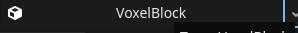
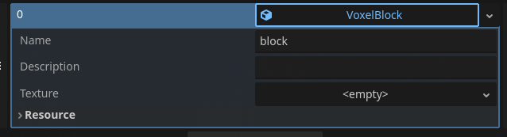

# Godot-Voxel
 
## How to use

 - Add voxel folder to your res:// folder
 - Create a new node in your scene
 - Add 'VoxelWorld.cs' Script to your node
 - Click on your node and view the inspector
 - To add a new block click on the Registered Blocks array and add a New Element
 - Click the drop down to add a new block (Don't drag in a script it won't work)
 - Click on  this will open some options to customize the block 
 - To add a Generator you can add one in the exact same way you added a block (see built in generator to see how you can make a custom Generator)